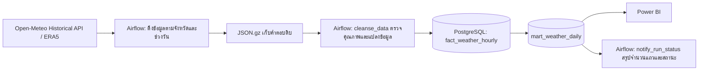

# Data Pipeline Design

## เป้าหมาย

วิเคราะห์แนวโน้มฝนตกหนักและสภาพอากาศที่ **จุดตัวแทนรายจังหวัด** ของประเทศไทยตั้งแต่ปี 2018 และออกแบบให้เติมข้อมูลย้อนหลังรายวันได้ ข้อมูลที่เผยแพร่ถึง 26 ก.ย. 2026 มี 5,896,968 แถวรายชั่วโมง

## รายละเอียดการไหลของข้อมูล

| ชั้นข้อมูล | หน่วยหนึ่งแถว | คีย์ | หน้าที่ |
|---|---|---|---|
| `dim_province` | จุดตัวแทนหนึ่งจังหวัด | `province_id` | ชื่อจังหวัดและพิกัด |
| `fact_weather_hourly` | จังหวัดหนึ่งแห่ง ณ หนึ่งชั่วโมง | `province_id`, `weather_time` | ข้อมูลสภาพอากาศรายชั่วโมงกว่า 5.8 ล้านแถว |
| `mart_weather_daily` | จังหวัดหนึ่งแห่ง ณ หนึ่งวัน | `province_id`, `weather_date` | ฝนรวม ค่าสภาพอากาศสรุป และชนิดฝนสำหรับ Power BI |
| `etl_batch` | จังหวัดหนึ่งแห่งต่อช่วงคำขอ | จังหวัดและวันเริ่ม–สิ้นสุด | ประวัติโหลดและรันซ้ำ |
| `pipeline_run_audit` | Airflow หนึ่งรอบ | `run_id` | สถานะและจำนวนแถวเพิ่มใหม่/อัปเดต |

Airflow เรียกงานทุกวันเวลา 14:00 น. ตามเวลาไทย และดึงข้อมูลได้ถึงวันย้อนหลัง 7 วันเพื่อลดความเสี่ยงจากระยะหน่วงของ ERA5 โดยตรวจวันที่ล่าสุดที่ครบในทุกจังหวัดแล้วเติมวันที่ขาดก่อนส่งออกไฟล์สำหรับ Power BI ส่วนการโหลดประวัติ 2018–2025 ทำด้วยคำสั่ง backfill ที่แบ่งเป็นช่วงปีและจังหวัด รวม 616 ชุดคำขอ งานที่สำเร็จแล้วจะถูกข้ามเมื่อสั่งรันซ้ำ

## กฎคุณภาพ

1. ตรวจว่ามีข้อมูลครบ 24 ชั่วโมงต่อวัน และจำนวนชั่วโมงตรงกับช่วงวันที่ขอ
2. ตรวจว่า API ส่งเวลา `Asia/Bangkok` และไม่มีเวลาในช่วงเดียวกันซ้ำ
3. ปฏิเสธค่าฝนติดลบหรือเกิน 1,000 มม. ต่อชั่วโมง ซึ่งเป็นเกณฑ์ตรวจความผิดปกติทางเทคนิค
4. ใช้คีย์หลักจังหวัด–เวลาและ upsert เพื่อป้องกันแถวซ้ำ
5. แสดง `incomplete` หากข้อมูลฝนรายวันมีน้อยกว่า 24 ชั่วโมง
6. ใช้ `python -m pipeline.cli validate` ตรวจจำนวนแถวและจังหวัดหลัง backfill

## นิยามการวิเคราะห์

ฝนรวมรายวันคือผลรวมฝนรายชั่วโมงตามวันปฏิทิน `Asia/Bangkok` ของป้ายเวลาที่ API ให้มา `heavy` ตั้งแต่ 35.1 มม./วัน และ `very_heavy` ตั้งแต่ 90.1 มม./วัน อ้างอิง [เกณฑ์ของกรมอุตุนิยมวิทยา](https://www.tmd.go.th/info/%E0%B9%80%E0%B8%81%E0%B8%93%E0%B8%91%E0%B8%AD%E0%B8%B2%E0%B8%81%E0%B8%B2%E0%B8%A8)

ค่าที่ได้เป็นฝนแบบจำลอง ณ จุดพิกัด ไม่ควรใช้สรุปว่าทั้งจังหวัดมีฝนหนัก หรือใช้เป็นคำเตือนน้ำท่วมโดยตรง พิกัดบางจังหวัดใกล้กันอาจอ้างถึงช่องกริด ERA5 เดียวกัน

## ประเด็นการใช้งานจริง

- สำหรับการทดลองใช้ SQLite ได้ แต่ Docker Compose ใช้ PostgreSQL เป็นฐานข้อมูลหลัก
- Power BI อ่านตารางรายวันซึ่งมี 245,707 แถวถึง 26 ก.ย. 2026 เพื่อให้การกรองและสร้างภาพทำได้ง่าย
- คำขอ API มีการลองซ้ำเมื่อเครือข่ายผิดพลาดหรือโดนจำกัดอัตราการเรียก หากเป็นการใช้เชิงพาณิชย์ต้องตรวจสิทธิ์จาก Open-Meteo
- เผยแพร่ผลพร้อมเครดิต Open-Meteo, ERA5, ผู้จัดทำชุดพิกัดจังหวัด และกรมอุตุนิยมวิทยาสำหรับเกณฑ์ฝน
