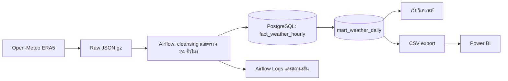

# Thailand Rainfall Observatory 🌧️

โครงการวิเคราะห์ฝนตกหนักและสภาพอากาศ **77 จังหวัดของประเทศไทย** ด้วยข้อมูลรายชั่วโมงจาก Open-Meteo ERA5 ตั้งแต่ปี 2018 มี Airflow สำหรับ ETL, PostgreSQL สำหรับเก็บข้อมูล, เว็บวิเคราะห์ในเครื่อง และรายงาน Power BI

> **ข้อมูลล่าสุดในชุดที่เผยแพร่:** 26 กันยายน 2026 · ปี 2026 ยังไม่ครบปี · ข้อมูลที่จุดพิกัดตัวแทนหนึ่งจุดต่อจังหวัด ไม่ใช่ค่าเฉลี่ยทั้งจังหวัด

## เปิดดูอะไรได้บ้าง

| ส่วน | ใช้ดูอะไร | วิธีเปิด |
| --- | --- | --- |
| เว็บวิเคราะห์ | ฝนหนักรายปี/รายเดือนแยกจังหวัด, เทียบช่วงเวลาเท่ากัน, อุณหภูมิ/ความชื้น/ลม, สถานะ ETL และโอกาสฝนตกวันนี้ | [http://localhost:8090](http://localhost:8090) หลังเปิด Docker |
| Airflow | ลำดับงาน, Logs, จำนวนแถวที่เพิ่ม/อัปเดต และสถานะรัน | [http://localhost:8088](http://localhost:8088) หลังเปิด Docker |
| PostgreSQL | ข้อมูลรายชั่วโมงกว่า 5 ล้านแถวและข้อมูลสรุปรายวัน | DBeaver เชื่อม `127.0.0.1:55432` |
| Power BI | หน้าภาพรวมและหน้าแนวโน้มฝนหนัก/สภาพอากาศ พร้อมตัวเลือกจังหวัด | [เปิดไฟล์ PBIX](powerbi/Thailand_Rainfall_2018_2026.pbix) |

## เริ่มใช้งานในเครื่อง

ต้องมี **Docker Desktop** และ **Git LFS** ก่อน clone เพราะ repository มีข้อมูลและไฟล์รายงานขนาดใหญ่

```powershell
git lfs install
git clone https://github.com/Theerapong25/Thailand-Rainfall-Observatory.git
cd Thailand-Rainfall-Observatory
Copy-Item .env.example .env
notepad .env
docker compose up -d --build
```

ใน `.env` ให้ตั้ง `POSTGRES_PASSWORD` และ `AIRFLOW_ADMIN_PASSWORD` เป็นรหัสผ่านตัวอักษร/ตัวเลขที่เลือกเองก่อนรัน Docker ไฟล์ `.env` จะไม่ถูกอัปโหลดขึ้น GitHub เมื่อบริการพร้อม เปิดเว็บวิเคราะห์ที่ `localhost:8090` และ Airflow ที่ `localhost:8088` (ผู้ใช้ `admin`, รหัสผ่าน `AIRFLOW_ADMIN_PASSWORD`) จากนั้นเลือก DAG `thailand_weather_daily` เพื่อตรวจงานประจำวัน ฐานข้อมูลสำหรับ DBeaver คือ `weather`, ผู้ใช้ `airflow`, รหัสผ่าน `POSTGRES_PASSWORD`; ดู [ตัวอย่าง SQL และวิธีเชื่อมต่อ](database/README_TH.md)

เมื่อเริ่มบน Docker volume ใหม่ บริการ `seed-postgres` จะนำเข้า CSV ที่มากับโครงการลง PostgreSQL ก่อนเปิด Airflow และเว็บ ขั้นตอนแรกอาจใช้เวลาหลายนาที ตรวจความคืบหน้าด้วย `docker compose logs -f seed-postgres` หากฐานมีข้อมูลอยู่แล้ว ระบบจะข้ามการนำเข้าเพื่อไม่สร้างข้อมูลซ้ำ

หากต้องการเติมวันที่ยังขาดทันที ให้สั่ง:

```powershell
docker compose exec airflow-scheduler airflow dags trigger thailand_weather_daily
```

DAG ทำงานเองทุกวันเวลา **14:00 น. ตามเวลาไทย** เมื่อ Docker เปิดอยู่ โดยดึงข้อมูลย้อนหลังได้ถึงวันปัจจุบันลบ 7 วัน หลัง Airflow ส่งออก CSV ใหม่ ให้กด **Home → Refresh** ใน Power BI Desktop เว็บอ่าน PostgreSQL โดยตรงและรีเฟรชได้จากปุ่มบนหน้าเว็บ

> เมื่อ clone ไปเครื่องอื่น ไฟล์ PBIX เปิดดูข้อมูลที่ฝังไว้ได้ทันที แต่ก่อนกด Refresh ต้องเปลี่ยน **Data source settings** ให้ชี้ไปที่ `powerbi/export/*.csv` ในเครื่องใหม่ ตาม [คู่มือ Power BI](powerbi/README.md)

## ข้อมูลไหลอย่างไร



Airflow ใช้งานตามลำดับ `plan_missing_days → extract_raw → cleanse_data → load_postgres → validate_postgres → refresh_powerbi_export → notify_run_status` งาน cleansing ตรวจชั่วโมงที่ขาด/ซ้ำ เขตเวลา และช่วงค่าฝน อุณหภูมิ ความชื้น และลม การโหลดใช้ upsert เพื่อรันซ้ำได้โดยไม่เพิ่มแถวซ้ำ ผลรันและจำนวนแถวใหม่อยู่ใน Airflow รวมทั้งตาราง `pipeline_run_audit`

## ชุดข้อมูลที่มี

| ชุดข้อมูล | ช่วงข้อมูล / ขนาด | อยู่ที่ไหน |
| --- | --- | --- |
| รายชั่วโมงใน PostgreSQL | 2018–26 ก.ย. 2026 · **5,896,968 แถว** | `fact_weather_hourly` |
| รายวันใน PostgreSQL | 2018–26 ก.ย. 2026 · **245,707 แถว** | `mart_weather_daily` |
| CSV รายชั่วโมงแยกปี | 2018–2026 | [`database/export/`](database/export/) |
| CSV สำหรับ Power BI | ถึง 26 ก.ย. 2026 | [`powerbi/export/`](powerbi/export/) |
| คำตอบ API และไฟล์ที่ทำความสะอาด | รายจังหวัด/ช่วงวัน | `data/raw/`, `data/cleaned/` |
| SQLite สำหรับทดลอง | สำเนาเก่าถึงปี 2025 | `data/weather.sqlite` |

ไฟล์ดิบและไฟล์ที่ทำความสะอาดของ **27 ก.ย. 2026** เตรียมไว้ครบ 77 จังหวัดแล้ว (1,848 แถวรายชั่วโมง) แต่ยังไม่อยู่ใน PostgreSQL/CSV/รายงาน PBIX ที่เผยแพร่ ณ 4 ต.ค. 2026 เพราะ Docker Desktop ไม่ทำงานในรอบที่เตรียมไฟล์ การสั่ง DAG หลังเปิด Docker จะโหลดวันที่ยังขาดและส่งออก CSV ใหม่

ไฟล์ `data/weather.sqlite`, CSV รายชั่วโมง, CSV รายวัน และ PBIX เก็บด้วย **Git LFS** เพื่อให้ repository ดาวน์โหลดไฟล์ใหญ่ได้ตามปกติ เมื่อต้องการ clone เฉพาะโค้ดโดยยังไม่ดาวน์โหลดไฟล์เหล่านี้ ใช้ `GIT_LFS_SKIP_SMUDGE=1` แล้วค่อยรัน `git lfs pull` เมื่อพร้อม

## เว็บประเมินฝนวันนี้

เลือกจังหวัดแล้วเว็บแสดงว่า “วันนี้มีแนวโน้มฝนตกหรือไม่” จากสัดส่วนวันที่มีฝนตั้งแต่ **0.1 มม.** ในช่วง ±15 วันรอบวันที่ปฏิทินเดียวกันของปี **2018–2025** ค่าเปอร์เซ็นต์เป็นความถี่ตามฤดูกาล ณ จุดตัวแทนจังหวัด ไม่ใช่พยากรณ์อากาศสด หน้าเว็บยังมีกราฟ สถิติ 30 วัน แนวโน้มรายเดือน และสถานะ Pipeline ตาม [คู่มือเว็บ](web/README_TH.md)

## คู่มือและไฟล์สำคัญ

| อ่านต่อ | รายละเอียด |
| --- | --- |
| [คู่มือเว็บ](web/README_TH.md) | หน้าเว็บ วิธีคำนวณ และวิธีตรวจข้อมูล |
| [คู่มือฐานข้อมูล](database/README_TH.md) | เชื่อม DBeaver และตัวอย่าง SQL |
| [คู่มือ Power BI](powerbi/README.md) | เปิดรายงาน เปลี่ยนที่อยู่ CSV และ Refresh |
| [การออกแบบ Pipeline](DESIGN.md) | ตารางข้อมูล กฎคุณภาพ และเหตุผลการออกแบบ |
| [ผลตรวจข้อมูลย้อนหลัง](RESULTS_TH.md) | ผลตรวจช่วงปี 2018–2025 |
| [รายงานตรวจความถูกต้องล่าสุด](audit/AUDIT_TH.md) | ตรวจทุกแถว เทียบข้อมูลดิบกับฐานข้อมูล และวัดความแม่นของการประเมินฝน |
| [รายงานตรวจความตรงตามหัวข้อ](audit/TOPIC_COVERAGE_TH.md) | เกณฑ์ตรวจครบทุกส่วนของหัวข้อ พร้อมผลเทียบตัวเลขจาก SQL เว็บ และ Power BI |

ทดสอบโค้ดด้วย `python -m unittest discover -s tests -q` หากต้องการหยุดบริการในเครื่อง ใช้ `docker compose stop`

## แหล่งข้อมูลและขอบเขตการใช้

- [Open-Meteo Historical Weather API](https://open-meteo.com/en/docs/historical-weather-api) — ข้อมูลย้อนหลัง ERA5; ตรวจ [ข้อกำหนดการใช้งาน](https://open-meteo.com/en/pricing) ก่อนนำไปใช้เชิงพาณิชย์
- [พิกัดตัวแทน 77 จังหวัด](https://github.com/dataengineercafe/thailand-province-latitude-longitude)
- [เกณฑ์ฝนของกรมอุตุนิยมวิทยา](https://www.tmd.go.th/info/%E0%B9%80%E0%B8%81%E0%B8%93%E0%B8%91%E0%B8%AD%E0%B8%B2%E0%B8%81%E0%B8%B2%E0%B8%A8) — ฝนหนักตั้งแต่ 35.1 มม./วัน และหนักมากตั้งแต่ 90.1 มม./วัน

ERA5 เป็นข้อมูล **reanalysis** จากแบบจำลอง ไม่ใช่ข้อมูลตรวจวัดจากสถานีหรือคำเตือนภัยฝน/น้ำท่วม จุดตัวแทนหนึ่งจุดไม่บอกสภาพทุกพื้นที่ในจังหวัด
